# TP 1 - Exploration de données avec Tableau

## Charger les données avec Tableau

### À quoi correspondent les icônes en tête de colonnes ?

Les icônes en têtes de colonnes nous informe sur le type de données déduis par Tableau, une [liste exhaustive](https://help.tableau.com/current/pro/desktop/en-us/datafields_typesandroles_datatypes.htm) est disponible dans la documentation.

### Lister les principaux types proposés.

- Text (string) values
- Date values
- Date & Time values
- Numerical values
- Boolean values (relational only)
- Geographic values (used with maps)
- Cluster Group (used with *Find Cluster in Data*)

### Quelles colonnes avez-vous dû corriger?

Colonne | Type d'origine | Type corrigé
-- | -- | --
Actualisation | Text | Date & Time
Département | Text | Geographic (State/Province)
Dep | Text | Geographic (Created From *Département*)
Incid Dc | Text | Numerical (decimal)
Incid Hosp | Text | Numerical (decimal)
Incid Rad | Text | Numerical (decimal)
Incid Rea | Text | Numerical (decimal)
Nb Orange | Text | Numerical (whole)
Nb Rouge | Text | Numerical (whole)
R | Text | Numerical (decimal)
Taux Occupation Sae | Text | Numerical (decimal)
Tx Incid | Text | Numerical (decimal)
Tx Pos | Text | Numerical (decimal)

> Dans la colonne **Actualisation**, les données brut (type *Text*) sont sous la forme `10/11/2020-20:09` alors que les données corrigées (type *Date & Time*) sont sous la forme `11/10/2020 20:09:00`. Tableau enregistre les dates sous le format `mm/dd/yyyy` alors que la notation française est `dd/mm/yyyy`.

### Quelles données sont manquantes ? Le sont-elles tout le temps ?

À l'aide d'un logiciel d'analyse de données (*Numbers*), nous obtenons le résultat suivant :

Nous remarquons la majorité des colonnes sont presque vide (*médianne des valeurs vide à **73.29%** du nombre total d'observation*), et ne contiennent donc que très peu d'information.

## Voir les résultats sous forme de bar chart

Pour obtenir le graphique ci-dessous, nous sélectionnons *Jour > Exact Date > Continuous* en colonne, et *SUM(Hosp)* en ligne. Puis nous sélectionnons *Swap Rows and Columns*.

> Si nous avions sélectionné *Jour > Day > Continuous* comme demandé, le graphique aurait été bruité par des lignes verticales. Les données brut sont déjà aggrégé par jour (toutes les observations sont entrées à 20h09).

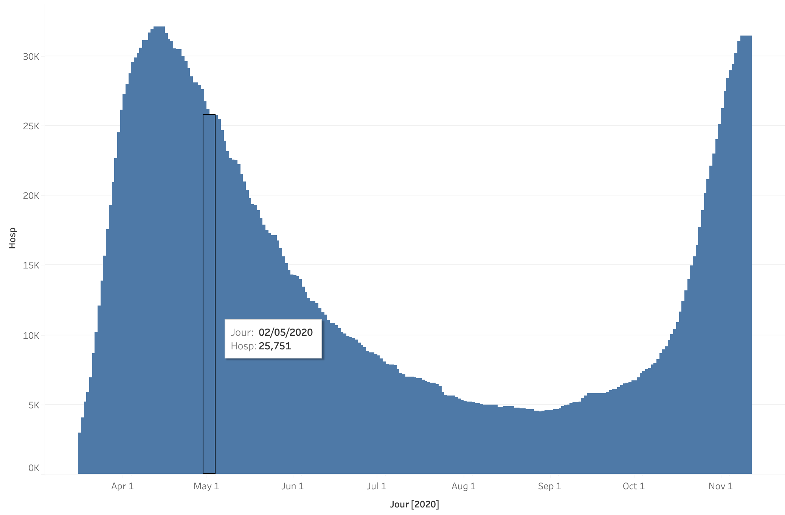

### Dans les données brut à quoi correspond une ligne d'hospitalisations.

*Pour un département français donné, pour un jour donné, le nombre de personnes hospitalisées en ce jour en ce département.*

### Comment Tableau a-t-il agrégé ?

Tableau a agrégé en sommant sur l'ensemble des département français. Comme nous avons selectionné *Exact Date*, Tableau ne groupe pas par jour.

### Dans quelle ordre les régions sont elles empilées ?

Les régions sont empilées, par défault, par ordre alphabétique.

*Ci-dessous le résultat après avoir changé l'ordre d'empilage par somme du nombre d'hospitalisation sur la période.*

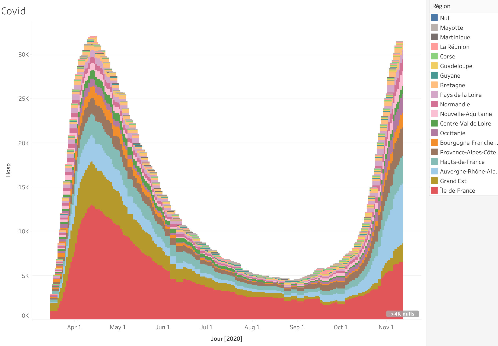

## Sauvegarder et partager

La visualision précendente est disponible sur [Tableau Public - Adrien Kaczmarek - TP1](https://public.tableau.com/app/profile/adrien.kaczmarek/viz/TP1-ALL/TP1-ALL)

## Filtrer de manière basique

### Quelles régions/départements avez-vous filtré?

Nous ne gardons que les *5 DOMs* :
- Mayotte
- Martinique
- La Réunion
- Guadeloupe
- Guyane

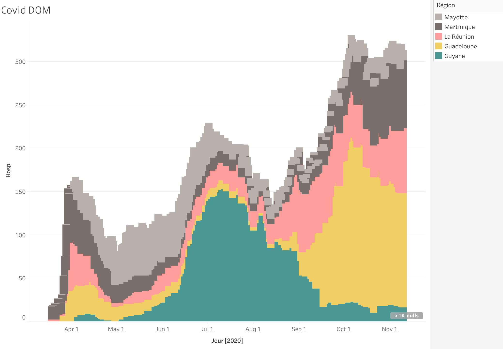

## Identifier les tendances

> Dans les graphiques suivants, les courbes **bleues** sont relatives aux hospitalisations, et le courbes **rouges** aux cas positifs.

Nous réalisons une moyenne lissée sur les **7** derniers jours du nombre d'hospitalisations en France (*tout territoires confondus*), et du nombre de cas positif.

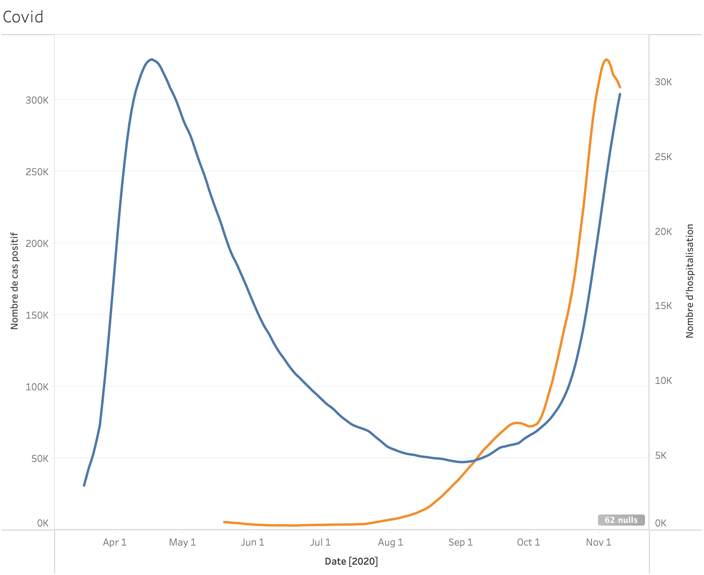

### Listez les périodes de croissances et de décroissances du virus.

Pour identifier rapidement les périodes de croissance et de décroissance, nous affichons les variations lissées du nombre d'hospitalisations en France (*tout territoires confondus*), et du nombre de cas positif.

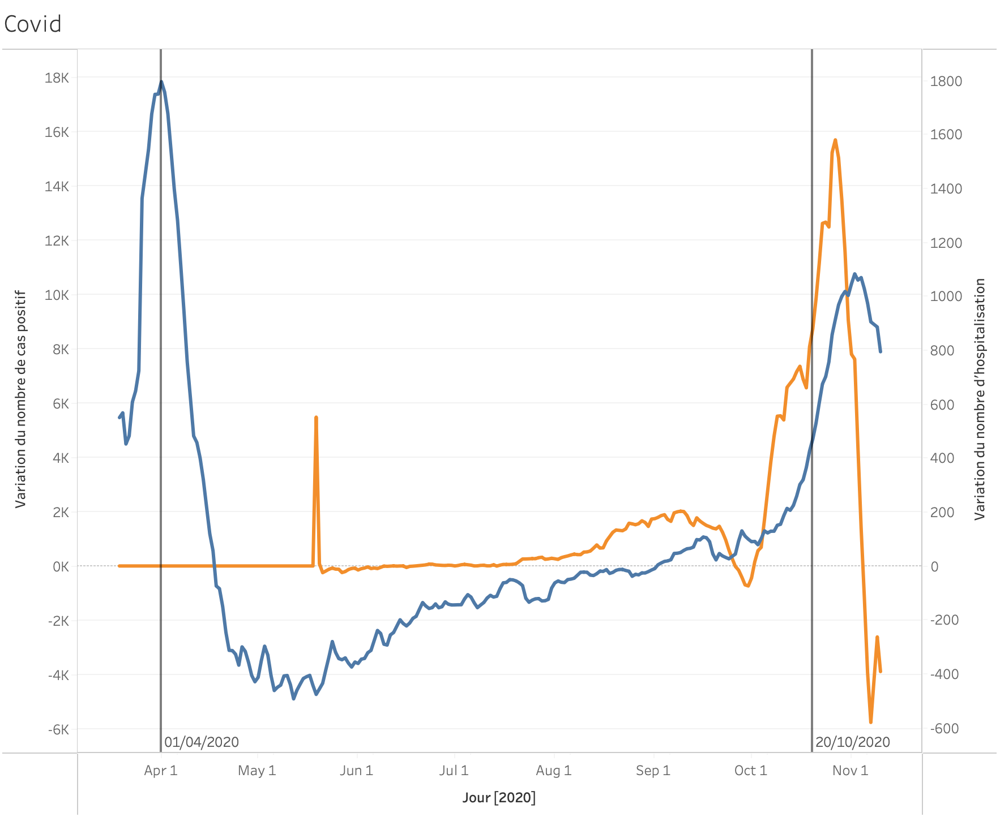

Nous remarquons une première période de forte croissance **début Avril**, suivi d'une forte décroissance **début Mai**, puis une croissance lente et une seconde croissance forte **mi-Octobre**.

### Quels décalage temporel pouvez vous identifier visuellement entre les différents indicateurs ?

Nous notons le second maximum de variation (*pire jour de l'épidémie*) pour le nombre de cas positif et le nombre d'hospitalisation.

Le nombre d'hospitalisation grandit au plus, lors de la seconde vague, le **3 Novembre 2022**, alors que le nombre de cas positif varie au plus le **27 Octobre 2022**.

Soit une décalge temporel d'**une semaine**.

## Cartographier

Les données non reconnues sont
- Grand Est : **FRF1** (Alsace)
- Guyane : **FRY3**
- Hauts-de-France : **FRE1** (Nord-Pas-de-Calais)
- Nouvelle-Aquitaine : **FRI1** (Aquitaine)
- Occitanie: **FRJ1** (Languedoc-Roussillon)

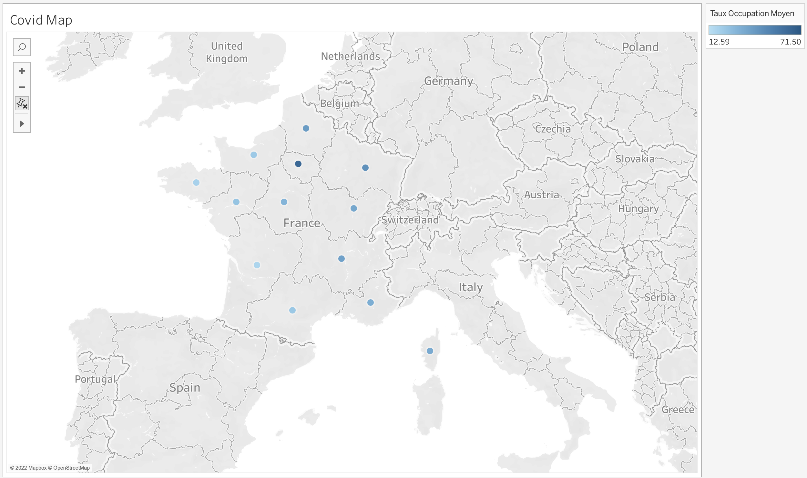
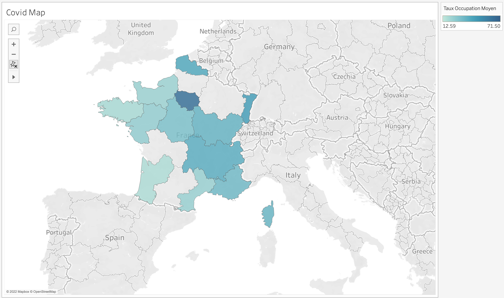

### Entre la carte de symbole et la carte pleine, laquelle vous semble le plus appropriée ?

La **carte pleine** semble plus approprié : 
- **plus** simple de voir la couleur (*même si des informations deviennent manquantes ou éronnée suite au mauvais encodage des régions*)
- **moins** de confusion : l'information concerne toute la région

### Quelles sont les régions (donnez en trois ou quatre) qui se sont déteriorées le plus tôt lors de la 2e vague ?

Lors de la première vague, la région **Île de France** et **Alsace** (Grand Est) ont été les premiers touchées.
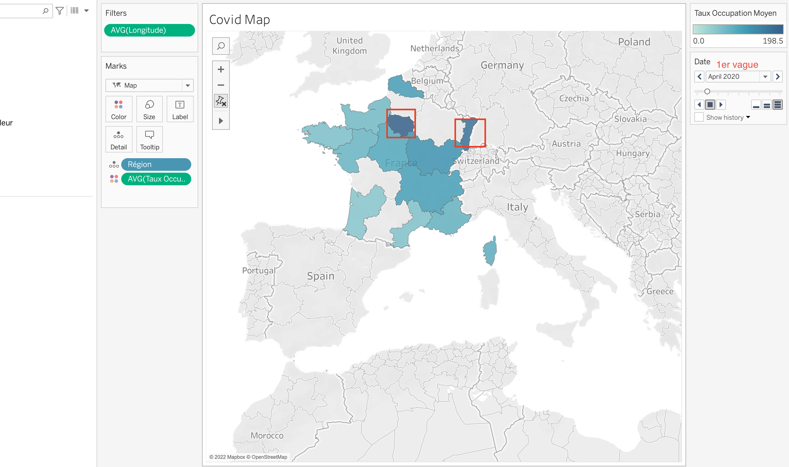

Cependant, lors de la **deuxième vague**, les régions du Sud (**Rhônes-Alpes**, et **Provences Alpes Côtes d'Azur**) avec le **Nord-Pas-de-Calais** (Hauts-de-France) ont été les premières touchées.

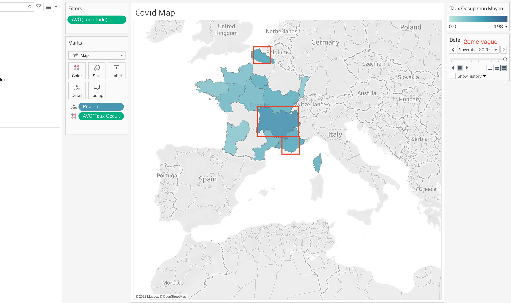

## Explorer d'autre représentation

Nous cherchons à savoir si la **densité de population** impacte le **nombre d'hospitalisation**. En effet, il nous semble évident qu'il existe une relation de **corrélation positive** entre ces deux variables. Nous examinons le graphique en deux dates.

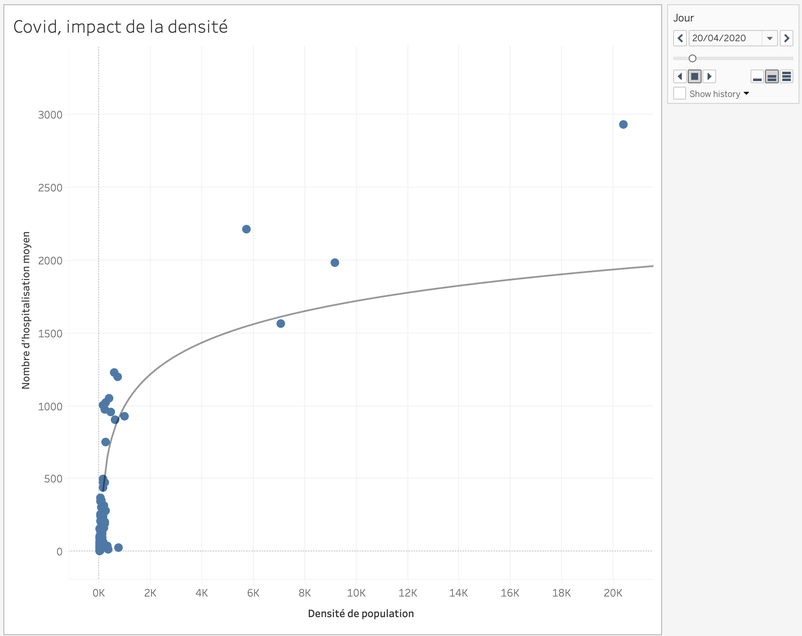
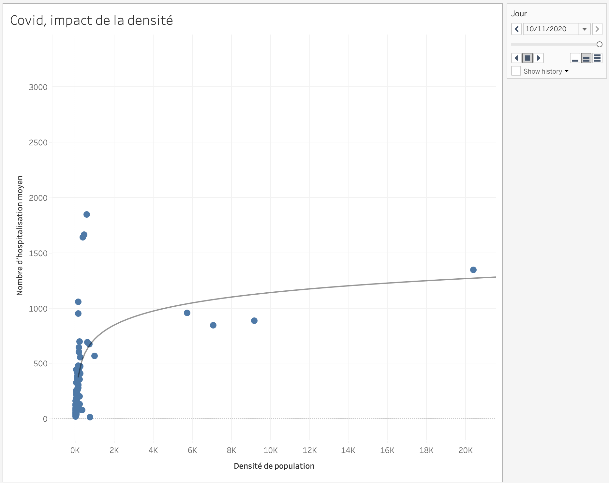

Contre toute attente, nous observons très peu de corrélation entre ces deux variables. Nous arrivons néanmoins à effectuer une régression logarithmique qui passe le test de significativité à `0.001`.

Cependant, ce test ne signifie pas grand chose ici, les quelques points à forte densité sont des cas isolés de grandes villes. Nous pouvons voir, que hormis ces cas, les observations sont quasiment selon une droite vertical, donc **une abscence de corrélation**.
