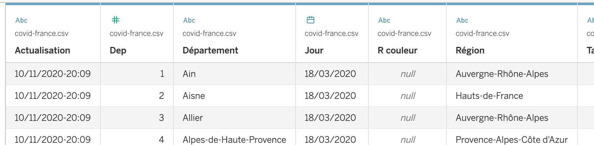
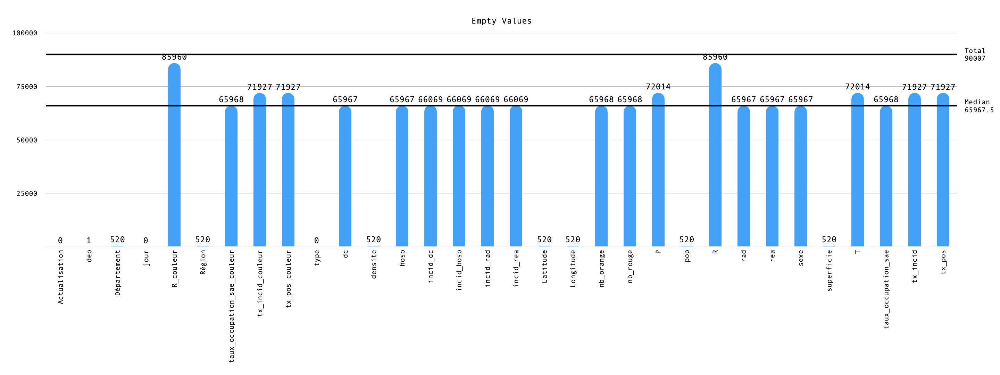

# TP 1 - Exploration de données avec Tableau

## Charger les données avec Tableau

### À quoi correspondent les icônes en tête de colonnes ?

Les icônes en têtes de colonnes nous informe sur le type de données déduis par Tableau, une [liste exhaustive](https://help.tableau.com/current/pro/desktop/en-us/datafields_typesandroles_datatypes.htm) est disponible dans la documentation.

### Lister les principaux types proposés.

- Text (string) values
- Date values
- Date & Time values
- Numerical values
- Boolean values (relational only)
- Geographic values (used with maps)
- Cluster Group (used with *Find Cluster in Data*)

### Quelles colonnes avez-vous dû corriger?

Colonne | Type d'origine | Type corrigé
-- | -- | --
Actualisation | Text | Date & Time
Département | Text | Geographic (State/Province)
Dep | Text | Geographic (Created From *Département*)
Incid Dc | Text | Numerical (decimal)
Incid Hosp | Text | Numerical (decimal)
Incid Rad | Text | Numerical (decimal)
Incid Rea | Text | Numerical (decimal)
Nb Orange | Text | Numerical (whole)
Nb Rouge | Text | Numerical (whole)
R | Text | Numerical (decimal)
Taux Occupation Sae | Text | Numerical (decimal)
Tx Incid | Text | Numerical (decimal)
Tx Pos | Text | Numerical (decimal)

> Dans la colonne **Actualisation**, les données brut (type *Text*) sont sous la forme `10/11/2020-20:09` alors que les données corrigées (type *Date & Time*) sont sous la forme `11/10/2020 20:09:00`. Tableau enregistre les dates sous le format `mm/dd/yyyy` alors que la notation française est `dd/mm/yyyy`.

### Quelles données sont manquantes ? Le sont-elles tout le temps ?

À l'aide d'un logiciel d'analyse de données (*Numbers*), nous obtenons le résultat suivant :

Nous remarquons la majorité des colonnes sont presque vide (*médianne des valeurs vide à **73.29%** du nombre total d'observation*), et ne contiennent donc que très peu d'information.

## Voir les résultats sous forme de bar chart
